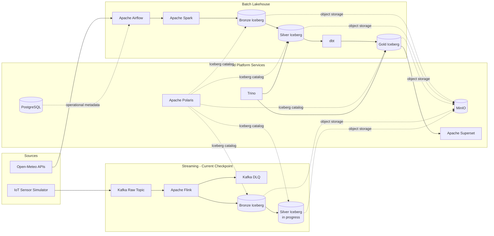

# Environmental Data Platform

> A production-oriented data engineering portfolio project combining batch ELT and real-time stream processing on an open lakehouse architecture.


## Overview

Environmental Data Platform is an end-to-end platform for ingesting, processing, validating, and analyzing weather and air-quality data across 12 cities in six countries.

The project demonstrates two complementary processing patterns:

- A batch lakehouse pipeline that ingests Open-Meteo data and produces analytics-ready Gold models.
- A streaming pipeline that simulates IoT sensor readings and processes them through Kafka and Flink.

The batch path is implemented end to end. The streaming path is currently being developed through the Silver Iceberg and event-deduplication stage. This README intentionally documents only the capabilities implemented at the current project checkpoint.

## Architecture



## Engineering Objectives

- Build a reproducible local platform from independently deployable services.
- Preserve raw source data before applying transformations.
- Use explicit Bronze, Silver, and Gold data contracts.
- Handle local timestamps and UTC timestamps without losing business context.
- Make ingestion idempotent and protect analytical tables from duplicate business keys.
- Apply quality gates before publishing curated datasets.
- Separate storage, catalog, compute, transformation, orchestration, and serving concerns.
- Support both historical API ingestion and event-driven sensor workloads.

## Technology Stack

| Layer | Technology | Responsibility |
|---|---|---|
| Orchestration | Apache Airflow | Batch dependencies, retries, timeouts, and quality checks |
| Batch compute | Apache Spark | JSON normalization, validation, deduplication, and Iceberg writes |
| Stream transport | Apache Kafka | Raw, clean, and dead-letter event topics |
| Stream compute | Apache Flink | Event validation, event-time processing, and streaming Iceberg jobs |
| Table format | Apache Iceberg | Transactional Bronze, Silver, and Gold lakehouse tables |
| Object storage | MinIO | S3-compatible data and checkpoint storage |
| Catalog | Apache Polaris | REST catalog and centralized Iceberg metadata |
| SQL engine | Trino | Query serving and dbt execution engine |
| Transformation | dbt | Staging, intermediate, Gold models, tests, and lineage |
| Visualization | Apache Superset | BI and analytical exploration |
| Metadata store | PostgreSQL | Platform, Airflow, Polaris, and Superset metadata |
| Runtime | Docker Compose | Reproducible local infrastructure |

## Batch Lakehouse Pipeline

### 1. Raw ingestion

Python ingestion jobs retrieve hourly weather and air-quality observations from Open-Meteo for 12 canonical cities. Each response is stored with crawl metadata, source identity, location attributes, requested time range, and the original API payload.

Raw data is retained before transformation to support replay, auditing, and schema investigation.

### 2. Bronze Iceberg

Spark reads raw JSON objects from MinIO and writes source-aligned Iceberg tables. Bronze processing preserves lineage while converting nested hourly arrays into queryable records.

### 3. Silver Iceberg

Silver jobs publish cleaned hourly weather and air-quality datasets. Processing includes:

- Schema normalization and explicit type casting.
- Local-time and UTC-time derivation.
- Exclusion of current-hour and forecast observations from historical datasets.
- Latest-crawl-wins deduplication using deterministic business keys.
- Null, range, duplicate, and temporal quality checks.
- Iceberg partitioning for analytical access.

The primary hourly business key is:

```text
city_id + measured_at_utc + source_system + dataset_name
```

### 4. dbt transformation layer

Trino exposes the Silver Iceberg tables to dbt. The transformation DAG is organized into three layers:

```text
silver.air_quality_hourly ─┐
                           ├─ staging
silver.weather_hourly ─────┘
                              │
                              ▼
                 weather + air-quality join
                              │
                              ▼
                 AQI classification and alerts
                              │
                              ▼
                   canonical hourly dataset
                              │
              ┌───────────────┼───────────────┐
              ▼               ▼               ▼
         hourly Gold      daily Gold      alert Gold
                                              │
                                              ▼
                                    correlation analysis
```

Current Gold models:

| Model | Grain | Purpose |
|---|---|---|
| `gold_city_environment_hourly` | City and UTC hour | Canonical weather and air-quality observations |
| `gold_city_environment_daily` | City and local date | Daily statistics, coverage, and worst AQI status |
| `gold_environmental_alerts` | Alerting city-hour | AQI events above the configured threshold |
| `gold_weather_air_quality_correlation` | City | Weather and particulate-matter correlations |

dbt tests enforce uniqueness, required fields, accepted values, metric ranges, source freshness, and model relationships.

### 5. Orchestration

The `environment_platform_elt` DAG coordinates both source branches independently before joining them at the dbt stage:

```text
crawl_air_quality → air_quality_bronze → air_quality_silver ─┐
                                                             ├→ dbt build → Trino smoke check
crawl_weather     → weather_bronze     → weather_silver ─────┘
```

Tasks include retry policies, execution timeouts, Spark cluster submission, and a final SQL assertion across the published Silver and Gold tables.

## Streaming Pipeline: Current Checkpoint

### Event contract

Sensor events follow a versioned JSON Schema. Each event contains:

- Immutable event and schema identifiers.
- Device, city, and country dimensions.
- Event time and producer time in UTC.
- A sequence number for device-level ordering.
- Temperature, humidity, PM2.5, PM10, CO, and NO2 measurements.

Validation runs before publication and again inside the processing layer. Semantic validation verifies canonical city mappings and prevents event time from being later than producer time.

### IoT simulator

The simulator produces reproducible, city-aware sensor readings and supports:

- Continuous or bounded generation.
- Deterministic random seeds.
- Per-city filtering.
- Local dry runs.
- Idempotent Kafka producer settings.
- Delivery callbacks and graceful shutdown.

### Kafka and Flink processing

The implemented streaming path includes:

```text
IoT Simulator
    → environment.sensor-readings.raw
        → Flink schema and semantic validation
            ├→ environment.sensor-readings.clean
            └→ environment.sensor-readings.dlq
        → Bronze Iceberg ingestion
```

Flink assigns event-time timestamps with bounded out-of-orderness. Invalid JSON and failed business validations are routed to a dead-letter topic with the original payload and failure reason.

### Work in progress

The active development checkpoint is the streaming Silver layer:

- Kafka-to-Iceberg checkpoint validation.
- Bronze-to-Silver field and range validation.
- Event-time parsing and watermarks.
- `event_id` deduplication.
- Batch backfill into an Iceberg v2 deduplicated table.

These SQL jobs are present as working implementation files and are not yet presented as a completed production path.

## Data Quality and Reliability

| Boundary | Controls |
|---|---|
| API ingestion | HTTP timeouts, metadata capture, source response preservation |
| Spark Bronze/Silver | Required fields, timestamps, ranges, duplicate keys, historical cutoffs |
| Streaming producer | JSON Schema and semantic validation before Kafka publication |
| Flink | Malformed-event isolation, field validation, DLQ routing, event-time watermarks |
| dbt | Uniqueness, relationships, accepted values, accepted ranges, source freshness |
| Airflow | Retries, timeouts, dependency control, final Trino smoke check |

## Repository Structure

```text
environment-data-platform/
├── dags/                   # Airflow DAGs
├── dbt/                    # Staging, intermediate, Gold models and tests
├── docker/                 # Service images and configuration
├── flink/
│   ├── sensor_stream_job/  # Java DataStream validation application
│   └── sql/                # Kafka, Bronze, Silver, and checkpoint SQL jobs
├── scripts/                # API ingestion and batch utilities
├── spark/jobs/             # Bronze/Silver Iceberg and catalog jobs
├── src/                    # Shared Python configuration and storage modules
├── streaming/              # Event contracts and IoT simulator
├── trino/                  # Iceberg REST catalog configuration
└── docker-compose.yml      # Local platform topology
```

## Running the Implemented Platform

### Prerequisites

- Docker Desktop with Docker Compose.
- Git.
- At least 12 GB of memory available to Docker is recommended for the complete stack.

### 1. Configure the environment

```bash
git clone <repository-url>
cd environment-data-platform
cp .env.example .env
```

Replace every `change_me` value and configure the Polaris credentials before starting the platform. Default credentials must not be reused in a shared environment.

### 2. Start the services

```bash
docker compose up -d --build
```

Polaris bootstrap is exposed through the `setup` profile:

```bash
docker compose --profile setup run --rm polaris-bootstrap
```

### 3. Open the service interfaces

| Service | Local endpoint |
|---|---|
| Airflow | `http://localhost:8080` |
| Spark master | `http://localhost:8090` |
| Flink dashboard | `http://localhost:8081` |
| MinIO console | `http://localhost:9001` |
| Polaris | `http://localhost:8181` |
| Trino | `http://localhost:8085` |
| Superset | `http://localhost:8088` |

### 4. Run the batch pipeline

Open Airflow, enable `environment_platform_elt`, and trigger the DAG. The DAG intentionally has no schedule while the platform is being developed and verified locally.

### 5. Validate the streaming contract

```bash
python -m streaming.contracts.validate_sensor_reading \
  streaming/contracts/examples/sensor_reading_v1.valid.json
```

### 6. Generate sensor events

Contract-only dry run:

```bash
python -m streaming.producer.iot_simulator \
  --count 10 \
  --seed 42 \
  --dry-run
```

Publish events to Kafka:

```bash
python -m streaming.producer.iot_simulator \
  --bootstrap-servers localhost:29092 \
  --count 100 \
  --interval-seconds 0.5
```

## Current Project Status

| Capability | Status |
|---|---|
| Open-Meteo weather and air-quality ingestion | Complete |
| Spark Bronze and Silver Iceberg processing | Complete |
| UTC/local-time normalization and deduplication | Complete |
| Polaris, MinIO, and Trino integration | Complete |
| dbt staging, intermediate, Gold models, and tests | Complete |
| Airflow end-to-end orchestration | Complete |
| Superset service integration | Complete |
| Versioned IoT event contract and simulator | Complete |
| Kafka validation, clean topic, and DLQ | Complete |
| Flink Bronze Iceberg ingestion | Implemented |
| Flink Silver validation and event-time processing | In progress |
| Streaming Iceberg deduplication and backfill | In progress |

---

This repository is being developed incrementally. Documentation will continue when the current streaming Silver and deduplication checkpoint is complete.
