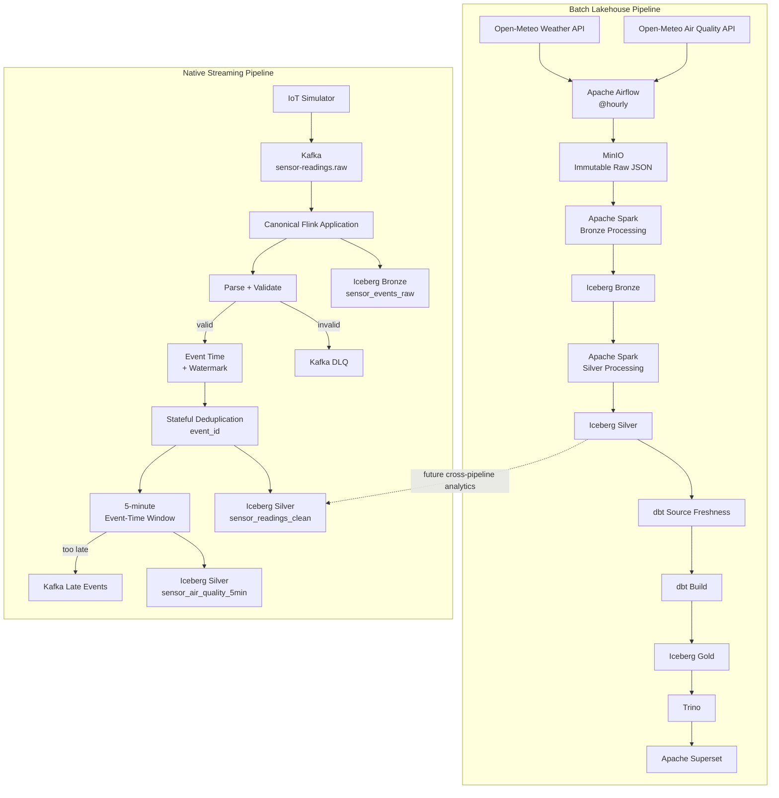

# Environmental Data Platform

> An end-to-end environmental data engineering platform combining batch lakehouse processing and native event-time streaming with Apache Spark, Apache Flink, Kafka, Apache Iceberg, Polaris, dbt, Trino, Airflow, MinIO, and Superset.


---

## Overview

The Environmental Data Platform is a portfolio-oriented data engineering project for collecting, processing, storing, validating, and serving environmental data through both **batch** and **native streaming** pipelines.

The platform currently implements two production data paths:

- A batch lakehouse pipeline for hourly weather and air-quality data from Open-Meteo.
- A native streaming pipeline for simulated IoT environmental sensor events using Kafka and Apache Flink.

The batch pipeline is orchestrated hourly by Apache Airflow and produces analytical Gold datasets consumed through Trino and Apache Superset.

The streaming pipeline uses a single canonical Flink application to persist raw events, validate sensor messages, process event time and watermarks, deduplicate events using state, write clean readings to Iceberg, calculate five-minute air-quality aggregates, and route invalid or excessively late records to dedicated Kafka topics.

The legacy local Clean Parquet and DuckDB warehouse paths used during early development have been removed from the active architecture.

---

## Business Problem

Environmental analytics often combines data with very different characteristics.

External weather and air-quality APIs are naturally suited to scheduled batch ingestion, while physical sensors continuously generate events that must be processed with low latency and event-time semantics.

This project demonstrates how both workloads can coexist in the same lakehouse platform while preserving:

- raw source lineage;
- reproducible transformations;
- business-key correctness;
- event-time processing;
- stateful deduplication;
- data quality checks;
- analytical serving;
- replay and recovery capabilities.

The current batch dataset covers a configured set of cities across multiple countries. The architecture itself is not tied to a fixed number of cities; additional locations can be onboarded through the platform's reference data and subsequent ingestion runs.

---

# Architecture



The batch and streaming pipelines share the same lakehouse foundation but currently have different analytical maturity.

Batch Silver data is already transformed into dbt Gold marts and served through Superset.

Streaming Bronze and Silver are production-ready, while cross-pipeline analytical models combining API reference data with IoT measurements are planned as the next integration phase.

---

# Technology Stack

| Layer | Technology | Responsibility |
|---|---|---|
| External sources | Open-Meteo | Weather and air-quality observations |
| Reference data | PostgreSQL | Supported city and platform metadata |
| Batch orchestration | Apache Airflow | Scheduling, dependencies, retries, timeouts and quality gates |
| Batch ingestion | Python | API requests, validation and raw persistence |
| Batch compute | Apache Spark | Bronze and Silver transformations |
| Streaming transport | Apache Kafka | Raw sensor events, DLQ events and late-event routing |
| Streaming compute | Apache Flink | Validation, event time, watermarks, state, deduplication and aggregation |
| Object storage | MinIO | Raw objects, Iceberg files and Flink checkpoints |
| Table format | Apache Iceberg | ACID lakehouse tables and snapshots |
| Catalog | Apache Polaris | Iceberg REST catalog |
| Transformation | dbt | Staging, intermediate, Gold marts and data tests |
| Query engine | Trino | SQL access to Iceberg |
| BI serving | Apache Superset | Analytical dashboards |
| Metadata storage | PostgreSQL | Airflow, Polaris, Superset and platform metadata |
| Runtime | Docker Compose | Local reproducible platform deployment |

---

# Batch Pipeline

## 1. API Ingestion

Python crawlers collect hourly data from:

- Open-Meteo Weather API
- Open-Meteo Air Quality API

The crawlers read supported city metadata from PostgreSQL and write each API response directly to MinIO.

No intermediate local Raw filesystem is required.

Raw objects follow a partitioned layout similar to:

```text
raw/
├── air_quality/
│   └── country=<country_code>/
│       └── city=<city_slug>/
│           └── crawl_date=<YYYY-MM-DD>/
│               └── air_quality_<timestamp>_<run_id>.json
│
└── weather/
    └── country=<country_code>/
        └── city=<city_slug>/
            └── crawl_date=<YYYY-MM-DD>/
                └── weather_<timestamp>_<run_id>.json
```

Each crawl creates a new immutable raw snapshot.

The crawler layer includes:

- retry and exponential backoff for transient HTTP failures;
- explicit handling of retryable HTTP status codes;
- strict validation of hourly API arrays;
- source and crawl metadata;
- direct MinIO persistence;
- failure propagation back to Airflow.

---

## 2. Bronze Layer

Apache Spark reads Raw JSON directly from MinIO and produces source-aligned Iceberg Bronze tables.

Bronze processing performs technical transformations such as:

- nested-array flattening;
- basic type casting;
- source metadata preservation;
- source-file lineage;
- crawl timestamp preservation;
- conversion into queryable Iceberg rows.

Bronze intentionally preserves overlapping API crawls.

Repeated observations from different crawl snapshots are allowed at this layer because Bronze represents source history rather than the canonical business state.

Representative tables:

```text
bronze.air_quality_hourly_raw
bronze.weather_hourly_raw
```

---

## 3. Silver Layer

Spark transforms Bronze into canonical hourly datasets.

Representative tables:

```text
silver.air_quality_hourly
silver.weather_hourly
```

Silver processing includes:

- local-time to UTC normalization;
- historical observation filtering;
- schema normalization;
- data-quality checks;
- canonical city identifiers;
- latest-crawl-wins selection;
- business-key deduplication.

The canonical hourly business key is:

```text
city_id
+ measured_at_utc
+ source_system
+ dataset_name
```

`city_name` is treated as a descriptive attribute rather than part of the key.

Replaying Silver processing against unchanged Bronze data produces the same business state and does not introduce duplicate business keys.

---

# dbt Analytics Layer

dbt reads the canonical Silver Iceberg tables through Trino.

The transformation project is organized into:

```text
staging
    ↓
intermediate
    ↓
marts / Gold
```

## Staging

Current staging models include:

```text
stg_air_quality_hourly
stg_weather_hourly
```

Responsibilities include:

- field naming conventions;
- light type normalization;
- source-level tests;
- data-quality contracts.

---

## Intermediate Models

Current intermediate models include:

```text
int_weather_air_quality_joined
int_air_quality_threshold_status
int_city_environment_hourly
```

These models contain reusable analytical logic without exposing dashboard-specific tables directly to source data.

---

## Gold Models

Current Gold marts include:

| Model | Grain / Purpose |
|---|---|
| `gold_city_environment_hourly` | Canonical environmental state by city and UTC hour |
| `gold_city_environment_daily` | Daily environmental summaries |
| `gold_environmental_alerts` | Environmental threshold and alert analysis |
| `gold_weather_air_quality_correlation` | Weather and air-quality analytical relationships |

Gold is the primary serving layer for analytical consumers.

---

# Data Quality

Data quality is enforced at multiple layers rather than relying only on generic `not_null` checks.

## Ingestion Quality

API crawlers verify the minimum payload contract before persisting data.

For hourly API responses, expected variable arrays must:

- exist;
- contain data;
- align with the hourly timestamp array;
- have compatible lengths.

Malformed API responses fail ingestion instead of silently entering the lakehouse.

---

## Silver Correctness

Silver jobs enforce a canonical business key:

```text
city_id
+ measured_at_utc
+ source_system
+ dataset_name
```

The latest crawl is selected when multiple Raw/Bronze snapshots contain the same business observation.

Replay testing verifies that rerunning Silver against unchanged Bronze input produces a stable result.

---

## dbt Tests

The dbt project includes tests for:

- required values;
- duplicate business keys;
- accepted ranges;
- environmental measurement constraints;
- source freshness.

Source freshness is checked before the Gold build in the Airflow DAG.

The batch orchestration therefore behaves as:

```text
Air Quality Silver ──┐
                     ├── dbt_source_freshness
Weather Silver ──────┘
                              ↓
                          dbt_build
                              ↓
                      trino_smoke_check
```

If source freshness fails, downstream analytical transformations do not proceed normally.

---

# Airflow Orchestration

The production batch DAG is:

```text
environment_platform_elt
```

It runs:

```text
schedule="@hourly"
catchup=False
max_active_runs=1
```

The dependency graph is:

```text
crawl_air_quality
        ↓
air_quality_bronze
        ↓
air_quality_silver
        ┐
        │
        ├── dbt_source_freshness
        │           ↓
        │       dbt_build
        │           ↓
        │   trino_smoke_check
        │
        │
crawl_weather
        ↓
weather_bronze
        ↓
weather_silver
        ┘
```

Airflow is responsible for orchestration rather than data transformation itself.

It controls:

- hourly scheduling;
- task dependencies;
- retries;
- execution timeouts;
- source-freshness gating;
- dbt execution;
- final Trino validation.

The DAG can still be manually triggered for development or troubleshooting, but normal operation uses the hourly schedule.

---

# Native Streaming Pipeline

The streaming subsystem simulates environmental IoT devices and processes their measurements continuously.

## Kafka Topics

The canonical production topics are:

```text
environment.sensor-readings.raw
environment.sensor-readings.dlq
environment.sensor-readings.late
```

### Raw Topic

```text
environment.sensor-readings.raw
```

Receives IoT sensor events produced by the simulator.

### DLQ Topic

```text
environment.sensor-readings.dlq
```

Receives malformed JSON or semantically invalid events.

### Late Topic

```text
environment.sensor-readings.late
```

Receives valid deduplicated records that arrive too late to participate in already-finalized event-time windows.

---

# Canonical Flink Application

The production Flink entry point is:

```text
com.environment.platform.streaming.CanonicalSensorStreamJob
```

A single Kafka source is consumed once and fan-outs internally to the required processing branches.

The application performs:

```text
Kafka Raw
    ↓
Raw persistence
    ├────────────→ Bronze Iceberg
    ↓
Parse
    ↓
Validate
    ├── invalid ─→ Kafka DLQ
    ↓
Event Time
    ↓
Watermark
    ↓
Stateful event_id Deduplication
    ↓
Silver sensor_readings_clean
    ↓
5-minute Event-Time Aggregation
    ├── finalized aggregate → sensor_air_quality_5min
    └── too late            → Kafka Late
```

This avoids running multiple independent Flink applications against the same canonical processing path.

---

# Streaming Bronze

Every Kafka event is persisted to Bronze before business validation.

Representative table:

```text
bronze.sensor_events_raw
```

Bronze stores the raw event together with Kafka metadata.

This means malformed or semantically invalid events can still be audited from the lakehouse even when they are routed to the DLQ.

Bronze represents what arrived from the source.

It is not affected by downstream deduplication.

---

# Streaming Validation and DLQ

After raw persistence, Flink parses and validates each event.

Validation covers the event contract and semantic requirements.

Failures are routed to:

```text
environment.sensor-readings.dlq
```

Only valid events continue to event-time processing.

---

# Event Time and Watermarks

The pipeline uses event time rather than processing time for analytical windows.

Valid sensor events receive event timestamps and Flink watermarks before stateful deduplication and aggregation.

This allows the platform to reason correctly about:

- network delay;
- out-of-order events;
- delayed producers;
- window completion;
- excessively late data.

---

# Stateful Deduplication

Valid events are deduplicated by:

```text
event_id
```

using Flink managed state.

Duplicate events do not generate additional canonical Silver measurements.

Deduplication is deliberately performed after parsing, validation, and event-time assignment.

The Raw Bronze layer remains unaffected and continues to preserve every Kafka event received by the platform.

---

# Streaming Silver

Canonical valid and deduplicated sensor events are stored in:

```text
silver.sensor_readings_clean
```

This table represents the clean event-level streaming state.

It can later be joined with batch reference datasets for cross-source analytics.

---

# Five-Minute Air Quality Aggregation

Flink produces event-time five-minute air-quality windows.

The aggregated output is stored in:

```text
silver.sensor_air_quality_5min
```

The aggregation uses the event-time watermark to determine when windows can be finalized.

Valid deduplicated events that arrive too late for finalized windows are routed to:

```text
environment.sensor-readings.late
```

instead of silently disappearing.

---

# Flink State and Recovery

The canonical streaming application uses Flink stateful processing.

Checkpoint state is persisted to MinIO under the platform checkpoint location:

```text
s3://environment-data/flink-checkpoints/
```

Checkpointing supports recovery of stateful operations such as event deduplication following application restarts or failures.

---

# Lakehouse Design

The project follows a layered lakehouse approach.

```text
Raw
 ↓
Bronze
 ↓
Silver
 ↓
Gold
```

## Raw

Source-native persisted objects.

Examples:

```text
Open-Meteo JSON
Kafka event payloads
```

## Bronze

Technical representation of source history.

Responsibilities:

```text
lineage
technical parsing
source metadata
raw event preservation
```

Duplicates may intentionally exist.

## Silver

Canonical trustworthy datasets.

Responsibilities:

```text
validation
normalization
UTC handling
latest-version selection
deduplication
canonical business keys
```

## Gold

Analytical datasets designed for BI and reporting.

Gold currently focuses on the batch environmental datasets.

Streaming Silver integration into combined Gold analytical models is the next major analytics milestone.

---

# Why Apache Iceberg?

Plain Parquet files provide efficient columnar storage but do not by themselves provide a full table abstraction.

Apache Iceberg adds:

- table metadata;
- snapshots;
- ACID commits;
- schema evolution capabilities;
- partition evolution;
- engine interoperability;
- reproducible table state.

The project uses MinIO for object storage and Polaris as the Iceberg REST catalog.

This allows Spark, Flink, Trino and dbt-driven SQL workloads to interact with the same lakehouse data model.

---

# Why Trino?

Trino is the analytical SQL access layer over Iceberg.

Instead of loading lakehouse data into a separate DuckDB warehouse, analytical consumers query Iceberg directly.

The serving path is:

```text
Iceberg
   ↓
Trino
   ↓
Superset
```

This keeps analytical serving connected to the lakehouse rather than maintaining a second duplicate warehouse.

---

# Superset Serving Layer

Apache Superset is the current BI serving layer.

Superset queries Gold datasets through Trino rather than accessing MinIO directly.

Typical analytical views include:

- city-level environmental conditions;
- PM2.5 and PM10 trends;
- weather versus air-quality relationships;
- environmental alerts;
- hourly and daily summaries;
- city and date filtering.

Superset is intended for business and analytical data.

Platform metrics such as Kafka consumer lag, Flink checkpoints, CPU, memory or backpressure belong to the future observability layer rather than Superset.

---

# Repository Structure

```text
environment-data-platform/
│
├── dags/
│   └── elt_pipeline.py
│
├── scripts/
│   ├── crawl_air_quality.py
│   ├── crawl_weather.py
│   ├── init_backend_db.sql
│   └── seed_backend_db.py
│
├── src/
│   └── environment_platform/
│       ├── config.py
│       ├── minio_storage.py
│       └── streaming/
│
├── spark/
│   └── jobs/
│       ├── air_quality_bronze_iceberg_job.py
│       ├── air_quality_silver_iceberg_job.py
│       ├── weather_bronze_iceberg_job.py
│       ├── weather_silver_iceberg_job.py
│       ├── polaris_namespace_smoke_test.py
│       └── polaris_iceberg_write_smoke_test.py
│
├── streaming/
│   ├── contracts/
│   │   ├── sensor_reading_v1.schema.json
│   │   ├── validate_sensor_reading.py
│   │   └── examples/
│   └── producer/
│       └── iot_simulator.py
│
├── flink/
│   ├── Dockerfile
│   ├── config/
│   ├── sql/
│   └── sensor_stream_job/
│       ├── pom.xml
│       └── src/main/java/
│           └── com/environment/platform/streaming/
│               ├── CanonicalSensorStreamJob.java
│               ├── model/
│               ├── process/
│               ├── serialization/
│               ├── sink/
│               └── validation/
│
├── dbt/
│   ├── dbt_project.yml
│   ├── profiles.yml
│   ├── macros/
│   ├── models/
│   │   ├── staging/
│   │   ├── intermediate/
│   │   └── marts/
│   └── tests/
│
├── trino/
│   └── catalog/
│       └── iceberg.properties
│
├── docker/
│   ├── dbt/
│   ├── streaming/
│   └── superset/
│
├── docker-compose.yml
├── .env.example
├── .gitignore
├── LICENSE
└── README.md
```

Legacy local Clean Parquet jobs, duplicate batch pipelines, DuckDB warehouse scripts, and obsolete streaming prototypes have been removed from the active repository path.

---

# Local Development

## Prerequisites

Recommended local environment:

```text
Docker / Docker Compose
WSL2 or Linux
Python
Java + Maven when rebuilding the Flink application
Git
```

Environment-specific configuration is provided through environment variables.

Copy the example configuration before starting the platform:

```bash
cp .env.example .env
```

Fill in the required local development values without committing secrets to Git.

---

# Start the Platform

From the repository root:

```bash
docker compose up -d
```

Check service state:

```bash
docker compose ps
```

The platform is designed to run locally through Docker Compose while allowing development commands to be executed from WSL.

---

# Run the Batch Pipeline

The Airflow DAG:

```text
environment_platform_elt
```

runs automatically every hour.

Check recent DAG runs:

```bash
docker compose exec airflow-scheduler \
  airflow dags list-runs \
  environment_platform_elt \
  --no-backfill \
  --output table
```

A healthy scheduled execution should appear with a run ID similar to:

```text
scheduled__<timestamp>
```

and eventually:

```text
state = success
```

---

# Validate dbt Sources

Run source freshness:

```bash
docker compose run --rm dbt source freshness
```

Run the complete dbt project:

```bash
docker compose run --rm dbt build
```

Both commands should complete successfully before treating the Gold layer as healthy.

---

# Validate the Streaming Contract

A valid example event is included in:

```text
streaming/contracts/examples/sensor_reading_v1.valid.json
```

Run contract validation:

```bash
python -m streaming.contracts.validate_sensor_reading \
  streaming/contracts/examples/sensor_reading_v1.valid.json
```

---

# Run the IoT Simulator

Example continuous producer:

```bash
python -m streaming.producer.iot_simulator \
  --count 0 \
  --interval-seconds 0.5 \
  --seed 100 \
  --bootstrap-servers localhost:29092
```

`--count 0` runs continuously until interrupted.

---

# Build the Canonical Flink Application

```bash
cd flink/sensor_stream_job

mvn clean package -DskipTests
```

The final shaded JAR is:

```text
target/sensor-stream-job.jar
```

Its production entry point is:

```text
com.environment.platform.streaming.CanonicalSensorStreamJob
```

The application class is packaged inside the shaded JAR and configured as its manifest `Main-Class`.

---

# Operational Verification

The project has been validated against several failure and replay scenarios.

## Batch

Validated behavior includes:

```text
crawler retry handling
strict API payload validation
overlapping Raw crawls
latest-crawl-wins Silver semantics
Silver replay / idempotency
zero duplicate canonical business keys
source-freshness recovery
dbt build
Gold duplicate checks
Airflow manual end-to-end run
Airflow scheduled end-to-end run
```

## Streaming

Validated behavior includes:

```text
Kafka raw ingestion
Bronze raw persistence
malformed event routing
semantic validation
Kafka DLQ routing
event-time assignment
watermarks
stateful event_id deduplication
Silver Iceberg persistence
five-minute event-time aggregation
late-event routing
Flink checkpoint completion
canonical application restart
shaded JAR packaging
```

---

# Current Project Status

| Capability | Status |
|---|---|
| Open-Meteo ingestion | Complete |
| Raw MinIO persistence | Complete |
| Spark Bronze | Complete |
| Spark Silver | Complete |
| Iceberg + Polaris | Complete |
| Trino querying | Complete |
| dbt staging / intermediate / Gold | Complete |
| dbt data-quality tests | Complete |
| dbt source freshness | Complete |
| Airflow hourly orchestration | Complete |
| Superset analytical serving | Complete |
| IoT simulator | Complete |
| Kafka raw ingestion | Complete |
| Streaming Bronze Iceberg | Complete |
| Parse / semantic validation | Complete |
| Kafka DLQ routing | Complete |
| Event time + watermarks | Complete |
| Stateful `event_id` deduplication | Complete |
| Streaming Silver Iceberg | Complete |
| Five-minute air-quality aggregation | Complete |
| Kafka late-event routing | Complete |
| Flink checkpoint/recovery baseline | Complete |
| Batch + streaming Gold integration | Planned |
| Prometheus + Grafana observability | Planned |
| Iceberg maintenance automation | Planned |
| Public Streamlit demo | Planned |

---

# Current Limitations

The project is designed as a local portfolio platform rather than a production cloud deployment.

Current limitations include:

### Batch scale

The current dataset is small enough that some Spark operations favor correctness and simplicity over large-scale optimization.

Silver processing currently favors deterministic whole-table reconstruction where required rather than relying on an unstable MERGE path in the current local Spark/Iceberg combination.

For significantly larger datasets, incremental Iceberg writes, partition pruning and maintenance strategies should be introduced.

### Raw Bronze scanning

Batch Bronze processing currently scans the available Raw history.

This is acceptable at the present scale but should evolve toward metadata-driven incremental ingestion as Raw history grows.

### Streaming analytics integration

Streaming Bronze and Silver are implemented, but the streaming Silver tables have not yet been integrated into the existing dbt Gold marts.

The next analytics phase will combine:

```text
Open-Meteo weather
+
Open-Meteo air quality
+
IoT sensor measurements
```

at compatible city and time grains.

### Observability

Platform monitoring through Prometheus and Grafana has not yet been implemented.

Superset should not be used as a replacement for infrastructure observability.

### Security

The current environment is optimized for local development.

A production deployment should add stronger secret management, TLS, network isolation, production authentication and infrastructure-level access policies.

---

# Next Milestones

The core batch lakehouse and native streaming pipelines are complete.

The next planned milestones are:

1. Integrate streaming Silver with batch analytical models.
2. Build cross-source city and time-grain Gold datasets.
3. Add Iceberg maintenance such as snapshot expiration and file compaction.
4. Add Prometheus and Grafana platform observability.
5. Harden local security and reproducible configuration.
6. Export small Gold snapshots for a public Streamlit portfolio demo.
7. Add architecture diagrams, screenshots and operational runbooks.

---

# Engineering Principles Demonstrated

This project intentionally focuses on engineering behaviors rather than only connecting tools.

Key principles demonstrated include:

- immutable Raw ingestion;
- source lineage;
- layered lakehouse modeling;
- canonical business keys;
- replay-safe processing;
- separation of Bronze and canonical Silver semantics;
- scheduled workflow orchestration;
- data freshness gates;
- automated data-quality tests;
- native event-time streaming;
- stateful deduplication;
- explicit DLQ handling;
- explicit late-data handling;
- checkpoint-based streaming recovery;
- separation between analytical BI and future platform observability;
- removal of obsolete architectural paths after migration.

---

# Architecture Evolution

The project evolved from an early local pipeline:

```text
API
 ↓
Local Raw
 ↓
Local Clean Parquet
 ↓
DuckDB
```

into the current lakehouse architecture:

```text
BATCH

Open-Meteo
    ↓
Airflow
    ↓
MinIO Raw
    ↓
Spark
    ↓
Iceberg Bronze
    ↓
Iceberg Silver
    ↓
dbt
    ↓
Iceberg Gold
    ↓
Trino
    ↓
Superset
```

and:

```text
STREAMING

IoT Simulator
    ↓
Kafka
    ↓
Canonical Flink Application
    ↓
Bronze + Validation + Event Time
    ↓
Stateful Deduplication
    ↓
Streaming Silver
    ↓
5-minute Aggregation
```

The old Clean Parquet and DuckDB paths were intentionally removed after the lakehouse pipeline became operational.

---

# Future Architecture

The planned analytical convergence is:

```text
Batch Silver ──────────────┐
                           │
Streaming Silver ──────────┼── dbt
                           │
Reference City Data ───────┘
                               ↓
                        Integrated Gold
                               ↓
                             Trino
                               ↓
                    Superset / Demo Export
```

Streaming and hourly API datasets have different grains and semantics, so future integration will align them by explicit city and event-time windows rather than blindly unioning the two sources.

---

# License

See [LICENSE](LICENSE) for license information.

---

# Author

This repository is developed as a hands-on Data Engineering portfolio project demonstrating modern batch, lakehouse, analytical and native streaming architecture.