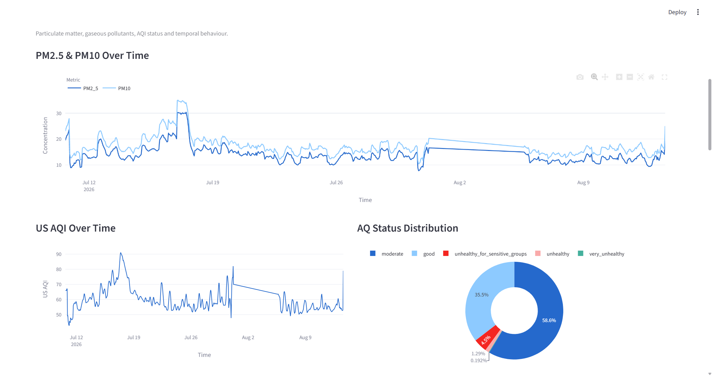
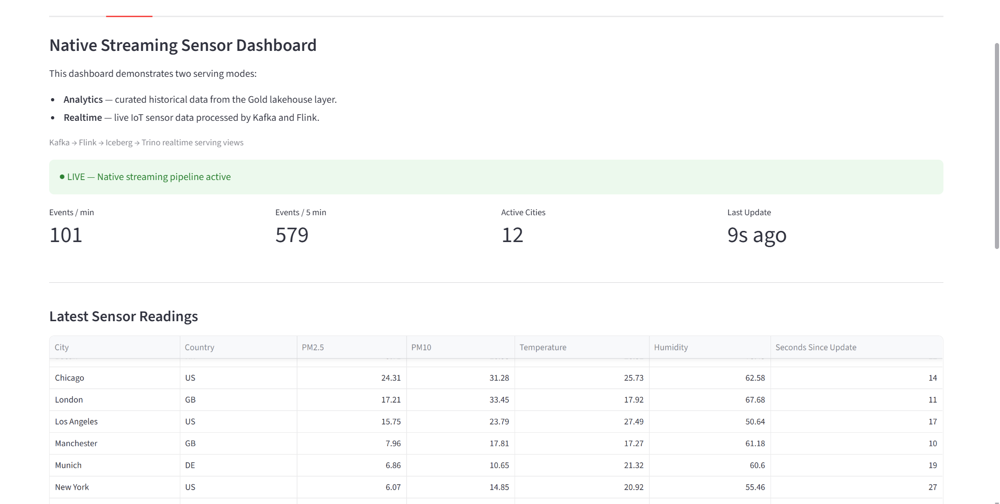
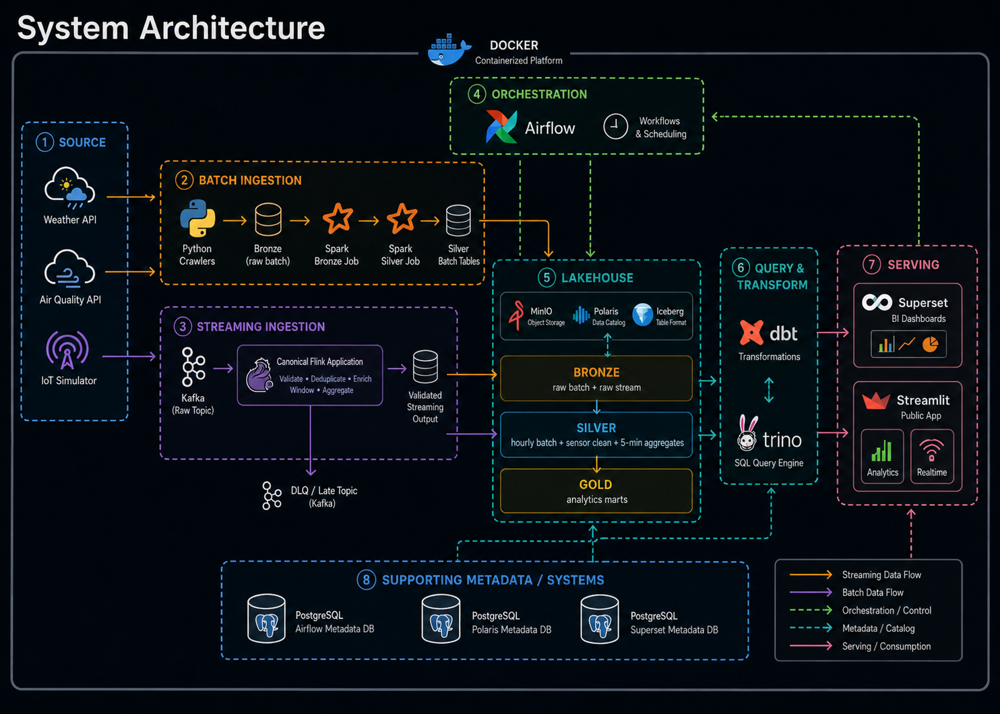
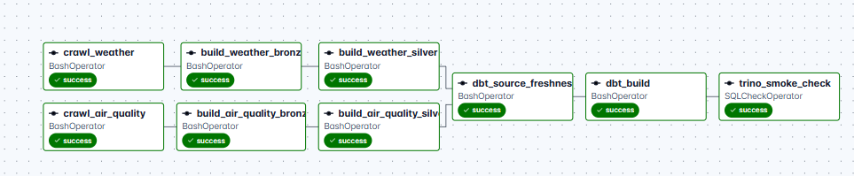
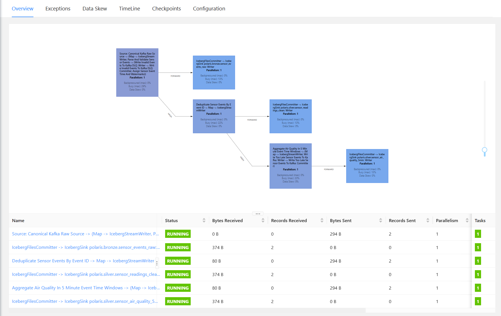
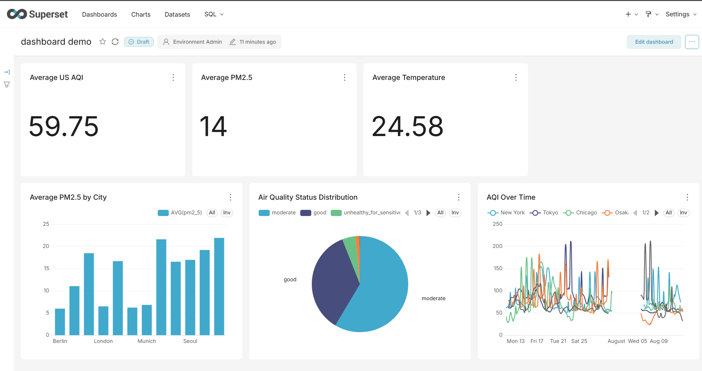

# Environmental Data Platform

> A hybrid batch and native streaming data platform for environmental analytics, built around an open Lakehouse architecture.

[](#technology-stack)
[](#apache-airflow--batch-orchestration)
[](#apache-spark--batch-processing)
[](#apache-kafka--event-transport)
[](#apache-flink--native-stream-processing)
[](#minio--apache-iceberg--lakehouse-storage)
[](#trino--sql-query-engine)
[](#dbt--analytical-transformation-and-data-quality)
[](#minio--apache-iceberg--lakehouse-storage)
[](#technology-stack)

**Live Demo:** [environment-data-platform.streamlit.app](https://environment-data-platform.streamlit.app/)

---

## The Problem: Environmental Data Does Not Arrive in One Way

Environmental analytics is not only a problem of collecting data. The harder engineering problem is that environmental data can arrive through very different delivery patterns and therefore requires different processing strategies.

From the platform's point of view, weather and air-quality APIs provide structured observations that are naturally suited to **scheduled batch ingestion**. They are useful for historical analysis, city-level comparisons, environmental trends, alerting, and analytical reporting.

A sensor network behaves differently. Sensors continuously produce individual events that may arrive out of order, be duplicated, arrive late, contain invalid payloads, or stop producing data temporarily. Processing this workload requires event-time semantics and stateful stream processing rather than simply running another scheduled batch job.

This creates two distinct engineering problems.

### Historical environmental analytics

```text
Open-Meteo Weather + Air Quality APIs
                ↓
        Scheduled ingestion
                ↓
       Historical analytics
```

The platform needs to collect hourly environmental observations, preserve raw source history, normalize time and schema, remove repeated business observations, enforce data quality, and transform the result into datasets that can be queried consistently.

### Continuous sensor processing

```text
Simulated IoT Sensor Events
             ↓
    Continuous event stream
             ↓
     Realtime processing
```

The streaming path must handle event time, out-of-order records, duplicate events, late data, invalid messages, state recovery, and low-latency serving.

A single processing model is therefore not ideal for both workloads.

---

## Solution: One Lakehouse, Two Processing Paths

The platform uses a **Hybrid Batch–Streaming Lakehouse Architecture**.

Instead of forcing both sources through the same processing engine, each workload uses the technology that matches its characteristics while both pipelines converge on the same Iceberg Lakehouse and analytical serving layer.

```text
                         Environmental Data
                                │
                  ┌─────────────┴─────────────┐
                  │                           │
                  ▼                           ▼
          Open-Meteo APIs               IoT Simulator
                  │                           │
                  ▼                           ▼
           Batch Pipeline              Streaming Pipeline
                  │                           │
               Airflow                       Kafka
                  │                           │
                Spark                        Flink
                  │                           │
                  └─────────────┬─────────────┘
                                ▼
                         Iceberg Lakehouse
                                │
                               dbt
                                │
                              Gold
                                │
                         Trino / Serving
```

### Batch path

The batch pipeline collects weather and air-quality data from Open-Meteo on an hourly schedule. Python crawlers persist immutable raw API responses to MinIO, Apache Spark builds Bronze and Silver Iceberg datasets, and dbt transforms curated data into analytical Gold models.

This path is optimized for historical environmental analysis, hourly city-level observations, reproducible transformations, business-key deduplication, and analytical reporting.

### Streaming path

The project does not use physical IoT devices. An **IoT Simulator** generates environmental sensor events to reproduce the behavior of a continuous sensor network.

The simulator does not replace Open-Meteo and its measurements are not treated as physical ground truth. Its purpose is to create a realistic streaming workload for validating event-time processing, stateful deduplication, late data handling, failure recovery, and realtime serving.

Kafka transports the events and Apache Flink continuously validates and processes them before writing streaming datasets into the same Iceberg Lakehouse.

> **Architecture note:** The platform has parallel batch and streaming paths, but it is not presented as a classical Lambda Architecture. The two paths originate from different source workloads rather than processing the same raw dataset twice.

---

## What the Platform Can Answer

The analytical layer is designed around practical environmental questions:

- How do PM2.5, PM10, AQI, and gaseous pollutants change by city and time?
- How do temperature, humidity, precipitation, wind, cloud cover, and visibility change over time?
- How are weather conditions associated with air-quality measurements?
- Which city-hours cross the platform's environmental alert thresholds?
- Is the simulated sensor pipeline currently active, and what are the latest sensor readings by city?
- How do simulated sensor measurements compare with the batch reference observations during overlapping city-hours?

The last comparison is treated as an **integration signal**, not as a sensor accuracy or ground-truth score.

---

## See It In Action

The project includes a public Streamlit application:

**https://environment-data-platform.streamlit.app/**

The application exposes two serving experiences:

**Analytics** presents historical environmental data exported from the curated Gold layer as a lightweight snapshot suitable for public hosting.

**Realtime** is designed to query Trino realtime serving views backed by the local Kafka → Flink → Iceberg pipeline. When that backend is not reachable from the public Streamlit deployment, the application intentionally displays an offline state instead of pretending that the stream is live.

### Historical Analytics

Explore historical weather and air-quality analytics with city, country, and date filters.



### Realtime Sensor Monitoring

The local Realtime experience demonstrates the simulated IoT pipeline while Kafka, Flink, Iceberg, and Trino are running.



---

# System Architecture



---

# Data Flow

## 1. Batch Environmental Pipeline

The batch path processes scheduled weather and air-quality observations.

### Flow 1 — Reference data

PostgreSQL stores the configured city reference data used by the crawlers. PostgreSQL is not the analytical warehouse; it provides operational/reference data for the platform and metadata stores for supporting services.

### Flow 2 — API ingestion

Apache Airflow triggers Python crawlers for the Open-Meteo Weather API and Air Quality API.

The crawlers validate the response contract and write each response directly to MinIO as immutable Raw JSON together with source and crawl metadata.

There is no active local Raw-file upload stage in the current architecture.

### Flow 3 — Bronze processing

Apache Spark reads Raw JSON directly from MinIO and converts the source payloads into queryable Bronze Iceberg tables.

Bronze keeps source history and technical lineage. Overlapping observations from repeated API crawls are allowed because this layer represents what was received from the source.

### Flow 4 — Silver processing

Spark builds canonical hourly Silver datasets by applying schema normalization, UTC normalization, quality checks, historical filtering, and latest-crawl-wins deduplication.

The canonical batch business key is:

```text
city_id
+ measured_at_utc
+ source_system
+ dataset_name
```

This prevents overlapping API crawls from creating duplicate business observations in the canonical Silver state.

### Flow 5 — Analytical transformation

dbt reads Silver tables through Trino and organizes SQL transformations into reusable staging, intermediate, and Gold models.

The current Gold layer supports hourly analytics, daily summaries, alert analysis, and weather/air-quality relationship analysis.

### Flow 6 — Serving

Trino provides SQL access to the Iceberg Lakehouse. Apache Superset uses this analytical serving path for BI, while the public Streamlit Analytics page uses a lightweight exported Gold snapshot.

---

## 2. Native Streaming Pipeline

The streaming path models continuously arriving environmental sensor events.

```text
IoT Simulator
      ↓
Kafka Raw Topic
      ↓
Canonical Flink Application
      │
      ├──────────────→ Bronze Raw Events
      │
      ↓
Parse + Validate
      ├── invalid ───→ Kafka DLQ
      ↓
Event Time + Watermark
      ↓
Stateful event_id Deduplication
      │
      ├──────────────→ Silver Clean Events
      │
      ↓
5-minute Event-Time Window
      ├──────────────→ Silver Aggregates
      └── too late ──→ Kafka Late Topic
```

The canonical Kafka topics are:

```text
environment.sensor-readings.raw
environment.sensor-readings.dlq
environment.sensor-readings.late
```

### Raw persistence

The canonical Flink application consumes the Kafka raw topic once and fans out internally. Incoming events are persisted to the Bronze Lakehouse before downstream business validation so the platform can retain what actually arrived.

### Validation and DLQ

Malformed JSON or semantically invalid events are routed to the DLQ topic instead of entering the canonical Silver stream.

### Event time and watermarks

Flink processes streaming analytics using event time rather than relying only on the machine's current processing time. Watermarks allow the pipeline to reason about delayed and out-of-order events and decide when event-time windows can be finalized.

### Stateful deduplication

Valid events are deduplicated by `event_id` using Flink managed state. Repeated events can remain visible in Bronze source history while canonical Silver measurements remain deduplicated.

### Five-minute aggregation and late data

Canonical sensor events feed five-minute event-time aggregations. Events that arrive beyond the accepted lateness policy are routed to the dedicated late-event Kafka topic rather than silently changing already-finalized results.

### Recovery

Flink checkpoints are stored on MinIO and externalized checkpoints are retained on cancellation. This allows the streaming application to recover its processing state after controlled restarts without relying only on in-memory state.

The project demonstrates recovery behavior but does not use the phrase "exactly once" as a blanket claim for every external side effect in the platform.

---

## 3. Unified Analytics Layer

Batch and streaming do not process the same raw source, but they meet in the analytical layer.

The hourly Gold model uses the batch environmental dataset as its historical backbone and can enrich overlapping city-hours with streaming sensor statistics such as event counts, device counts, sensor averages, and sensor-minus-batch differences.

This allows one analytical model to answer both historical questions and integration questions without pretending that the simulated sensor readings are authoritative measurements.

---

# Why These Technologies?

The project intentionally assigns different responsibilities to different tools. The goal is not to maximize the number of technologies in the repository; each major component exists because it solves a specific problem in the data flow.

## Apache Airflow — Batch Orchestration

Airflow is used for **workflow orchestration**, not for data transformation.

The batch pipeline has multiple dependent stages: API crawling, Spark Bronze, Spark Silver, dbt freshness, dbt build, and final Trino validation. Airflow provides scheduling, dependency management, retries, execution timeouts, run visibility, and failure propagation across those stages.

The current batch DAG is scheduled hourly with `catchup=False` and `max_active_runs=1`, which avoids overlapping scheduled runs on the local platform.

A cron script could trigger one command, but it would not provide the same dependency graph, task-level retry behavior, and operational visibility for a multi-stage data pipeline.

---

## Apache Spark — Batch Processing

Spark is responsible for batch Bronze and Silver processing.

The API workload requires nested JSON flattening, schema normalization, timestamp handling, deduplication, and Iceberg writes across many source objects. These are naturally batch-oriented transformations.

Spark is therefore used where distributed batch processing semantics make sense. It is not used to consume the continuous IoT event stream in this project.

---

## Apache Kafka — Event Transport

Kafka is used only where the system has an actual event-streaming requirement.

The IoT Simulator can continuously produce events while Flink independently consumes them. Kafka provides a durable event log, partitions, offsets, replay capability, and separate routing paths for raw, DLQ, and late-event traffic.

The scheduled Open-Meteo API path does not go through Kafka because introducing a broker there would add infrastructure without solving a current business requirement.

---

## Apache Flink — Native Stream Processing

Flink is used because the streaming problem is not just "process small batches frequently."

The sensor pipeline requires:

- event-time processing;
- watermarks;
- managed state;
- stateful `event_id` deduplication;
- late-event handling;
- event-time windows;
- continuous processing;
- checkpoint-based state recovery.

These are first-class stream-processing concerns and are the reason Flink exists alongside Spark rather than replacing it or duplicating the same workload.

---

## MinIO + Apache Iceberg — Lakehouse Storage

MinIO provides S3-compatible object storage for Raw JSON, Iceberg data files, metadata files, and Flink checkpoints.

Object storage is a better foundation than passing intermediate files through a developer's local filesystem because batch and streaming engines can access the same storage layer directly.

Apache Iceberg adds table semantics on top of object storage, including atomic table commits, snapshots, schema evolution support, and a consistent table abstraction for Spark, Flink, Trino, and dbt-based analytics.

This replaced the earlier architecture in which Clean Parquet files and a local DuckDB database acted as the main analytical path.

---

## Apache Polaris — Iceberg Catalog

Iceberg tables need a catalog that coordinates table names, metadata locations, and table operations across engines.

Apache Polaris provides the shared catalog layer used by the platform so Spark, Flink, and Trino can refer to the same Iceberg tables instead of maintaining separate views of the Lakehouse.

The catalog is metadata infrastructure; MinIO still stores the actual table data and Iceberg metadata files.

---

## Trino — SQL Query Engine

Trino is the common SQL access layer over the Iceberg Lakehouse.

It allows dbt, Superset, Streamlit's local realtime backend, and engineers running SQL validation to query the same tables without moving the data into a separate warehouse database.

DuckDB was useful during the project's earlier local-file stage, but after the Lakehouse migration a shared SQL engine over Iceberg became a better fit for a multi-service architecture.

---

## dbt — Analytical Transformation and Data Quality

dbt owns the SQL analytical layer rather than mixing dashboard business logic into Spark jobs.

The project separates transformations into:

```text
Staging
   ↓
Intermediate
   ↓
Gold / Marts
```

This keeps source cleanup, reusable business logic, and serving models separate. dbt also provides source freshness checks and model tests so analytical correctness is validated as part of the Airflow pipeline rather than only by visually checking dashboards.

---

## Apache Superset + Streamlit — Two Serving Needs

Superset and Streamlit are not intended to do the same job.

**Apache Superset** is the platform's BI serving layer. It queries Gold data through Trino and is suitable for analytical exploration and dashboarding inside the local platform.

**Streamlit** is the public portfolio application. It provides a simpler product-facing interface for historical analytics and a realtime sensor demo.

For the public deployment, historical Analytics uses a committed Gold snapshot rather than exposing the local Trino service directly to the internet. This is a deliberate serving trade-off for a personal portfolio project.

---

## PostgreSQL — Reference and Service Metadata

PostgreSQL supports several operational roles in the platform, including city reference data and metadata required by services such as Airflow, Polaris, and Superset.

These PostgreSQL databases are supporting system stores. They are not the analytical Lakehouse and do not replace Iceberg Gold tables.

---

## Docker Compose — Reproducible Local Platform

The platform contains several distributed-system components with different runtime dependencies. Docker Compose provides a reproducible local environment and explicit service networking without requiring every technology to be installed directly on the host OS.

The project is intentionally a local containerized platform today rather than claiming a Kubernetes or always-on cloud deployment that has not been implemented.

---

# Lakehouse Design

The platform uses a layered data model, but each layer has a clear responsibility rather than simply duplicating the same data three times.

| Layer | Purpose | Examples |
|---|---|---|
| Raw Landing | Preserve immutable external API responses | Weather and air-quality JSON objects |
| Bronze | Preserve source-aligned, technically queryable history | Batch source rows and raw streaming events |
| Silver | Canonical, validated, deduplicated data | Hourly batch observations and clean sensor events/aggregates |
| Gold | Business-facing analytical datasets | Hourly analytics, daily summaries, alerts, correlations |
| Realtime Views | Low-latency serving projections | Pipeline status, latest city readings, 1-minute timeseries |

Representative current Gold marts include:

```text
gold_city_environment_hourly
gold_city_environment_daily
gold_environmental_alerts
gold_weather_air_quality_correlation
```

The architecture diagram intentionally does not list every table. Table-level detail belongs in the data model and dbt documentation rather than in the high-level system picture.

---

# Data Quality and Reliability

Quality controls exist at multiple points because different failures need to be caught at different layers.

## API ingestion quality

The crawlers validate the minimum expected API payload structure before accepting a response. Invalid or inconsistent hourly arrays fail ingestion instead of silently entering the analytical path.

## Batch canonicalization

Silver uses the business key:

```text
city_id + measured_at_utc + source_system + dataset_name
```

When repeated Raw/Bronze crawl snapshots contain the same business observation, Silver selects the canonical latest version instead of creating duplicate business rows.

## dbt quality gates

The dbt project includes source freshness and model tests covering required fields, uniqueness/duplicate keys, accepted values or measurement ranges, and analytical contracts.

Airflow runs source freshness before the dbt build, so stale source data can block downstream analytical transformations.

## Final serving validation

The Airflow DAG ends with a Trino smoke check that verifies the main Silver and Gold datasets are queryable and contain expected data before the run is considered complete.

## Streaming quality

The Flink pipeline separately handles:

```text
invalid event    → DLQ
valid duplicate  → stateful deduplication
valid on-time    → canonical Silver / aggregation
valid too-late   → Late topic
```

This prevents one generic "bad data" path from hiding fundamentally different streaming conditions.

---

# Airflow Orchestration

The current batch DAG is:

```text
environment_platform_elt
```

with:

```text
schedule="@hourly"
catchup=False
max_active_runs=1
```

Its main dependency graph is:

```text
crawl_air_quality
        ↓
build_air_quality_bronze
        ↓
build_air_quality_silver ──┐
                            │
                            ├─→ dbt_source_freshness
                            │            ↓
crawl_weather               │        dbt_build
        ↓                   │            ↓
build_weather_bronze        │     trino_smoke_check
        ↓                   │
build_weather_silver ───────┘
```


Airflow orchestrates the batch workload. It does not schedule each sensor event and is not placed in the hot path of the native Flink stream.


---

# Realtime Serving

The local realtime serving layer is exposed through Trino views rather than having Streamlit query raw Kafka topics or internal Flink state directly.

Current views include projections for:

- overall sensor pipeline liveness;
- latest reading by city;
- one-minute sensor timeseries.

The liveness view uses the latest processing timestamp to calculate recent event counts, active cities, time since the last processed event, and an `is_live` state.

The Streamlit realtime fragment refreshes periodically and degrades gracefully when the backend is unavailable.



---

# Serving Layer

## Apache Superset

Superset is connected through Trino to curated Gold data and acts as the BI layer for analytical exploration.

It is intentionally separated from platform observability. Business charts belong in Superset; Kafka lag, Flink checkpoints, container CPU, and similar platform metrics belong in an observability system.



## Streamlit

Streamlit provides the public-facing portfolio application.

The Analytics experience uses historical Gold data with filters and environmental visualizations. The Realtime experience demonstrates the simulated IoT serving path when the local backend is reachable.

This separation keeps the public demo inexpensive and safe while the full distributed platform remains local.

---

# Technology Stack

| Layer | Technology | Responsibility |
|---|---|---|
| External data | Open-Meteo | Weather and air-quality API observations |
| Reference data | PostgreSQL | City configuration and operational reference data |
| Batch orchestration | Apache Airflow | Scheduling, dependencies, retries, freshness gates |
| Batch ingestion | Python | API crawling, validation, Raw persistence |
| Batch compute | Apache Spark | Bronze and Silver batch processing |
| Stream producer | IoT Simulator | Simulated continuous environmental sensor events |
| Event transport | Apache Kafka | Raw stream, DLQ, late-event transport |
| Stream compute | Apache Flink | Validation, event time, watermarks, state, deduplication, windows |
| Object storage | MinIO | Raw objects, Iceberg files, checkpoints |
| Table format | Apache Iceberg | Lakehouse tables and snapshots |
| Catalog | Apache Polaris | Shared Iceberg REST catalog |
| Transformation | dbt | Staging, intermediate, Gold, tests and freshness |
| SQL serving | Trino | SQL access to Iceberg |
| BI | Apache Superset | Gold analytical dashboards |
| Public demo | Streamlit | Historical Analytics and realtime demo UI |
| Runtime | Docker Compose | Reproducible local multi-service environment |

---

# Architecture Evolution

The project did not begin with the final Lakehouse architecture. An earlier implementation used local intermediate files and DuckDB:

```text
Open-Meteo API
      ↓
Python crawler
      ↓
Local Raw JSON
      ↓
Upload script
      ↓
MinIO
      ↓
Local Clean Parquet
      ↓
Upload script
      ↓
MinIO
      ↓
DuckDB
```

That design was useful for validating the first end-to-end workflow, but it created unnecessary local-file handoffs and a separate analytical database.

The active architecture was refactored toward:

```text
Open-Meteo API
      ↓
Python → MinIO Raw
      ↓
Spark → Iceberg Bronze / Silver
      ↓
dbt → Iceberg Gold
      ↓
Trino → Superset / Streamlit
```

and later extended with the native streaming path:

```text
IoT Simulator → Kafka → Flink → Iceberg
```

This evolution is part of the project: the goal was not only to add technologies, but to remove unnecessary file movement and converge batch and streaming workloads on one Lakehouse foundation.

---

# Local Development

## Prerequisites

The repository is designed around Docker Compose. A typical local environment requires:

- Docker / Docker Compose;
- Git;
- enough local memory for the selected services;
- Python when running the simulator or Streamlit directly from the host/WSL environment.

## 1. Clone the repository

```bash
git clone https://github.com/ducmanh9898-sudo/data---elt---paltform.git
cd data---elt---paltform
```

## 2. Create local environment configuration

```bash
cp .env.example .env
```

Review the values before starting the services. Secrets and local runtime data should not be committed.

## 3. Start the platform

```bash
docker compose up -d --build
```

Check service status with:

```bash
docker compose ps
```

Because this is a resource-heavy local platform, services can also be started selectively during development instead of keeping the entire stack running all the time.

## 4. Batch pipeline

The Airflow DAG `environment_platform_elt` is scheduled hourly while the Airflow scheduler is running. It can also be triggered manually from Airflow during development and troubleshooting.

## 5. Streaming producer

A continuous simulator run can be started from the project environment with:

```bash
python -m streaming.producer.iot_simulator \
  --count 0 \
  --interval-seconds 0.5 \
  --bootstrap-servers localhost:29092
```

The canonical streaming application consumes the Kafka raw topic and writes its Lakehouse outputs through Flink.

## 6. Local Streamlit application

```bash
python -m streamlit run streamlit_app/app.py
```

The local app can query the realtime Trino serving views when the streaming backend is running.

> Local ports and credentials are controlled by `docker-compose.yml` and `.env`. Use `docker compose ps` as the source of truth for the active local deployment.

---

# Repository Structure

The repository is organized by platform responsibility rather than as one large Python application.

```text
environment-data-platform/
├── dags/                   # Airflow batch orchestration
├── dbt/                    # Staging, intermediate, Gold and realtime SQL models
├── docker/                 # Service-specific container configuration
├── flink/                  # Canonical Flink streaming application
├── requirements/           # Component-oriented Python dependencies
├── scripts/                # Crawlers and operational scripts
├── spark/
│   └── jobs/               # Spark Bronze / Silver batch jobs
├── src/                    # Shared Python platform modules
├── streamlit_app/          # Public Analytics + realtime demo application
├── trino/                  # Trino configuration / Iceberg catalog integration
├── docker-compose.yml      # Local distributed platform
├── .env.example            # Environment configuration template
└── README.md
```

The exact repository tree may evolve as platform operations and observability are added, but the separation of ingestion, compute, transformation, serving, and infrastructure responsibilities is intentional.

---

# Current Limitations

This repository is a portfolio platform and the README deliberately avoids presenting planned capabilities as already implemented.

- **The IoT source is simulated.** It demonstrates streaming engineering behavior; it is not a physical sensor deployment and its values are not treated as ground truth.
- **The distributed platform runs locally with Docker Compose.** It is not currently an always-on cloud platform.
- **The public Streamlit Analytics page uses an exported Gold snapshot.** Streamlit Community Cloud does not directly query the Lakehouse running on a developer laptop.
- **Public realtime availability depends on backend reachability.** When the local Kafka/Flink/Trino stack is not reachable, the Streamlit app correctly displays the realtime backend as offline.
- **Dedicated Prometheus/Grafana platform observability is not implemented yet.** Superset is used for business analytics, not infrastructure monitoring.
- **The streaming source is designed to validate native streaming semantics**, not to claim that simulated measurements are more authoritative than Open-Meteo observations.

These are explicit trade-offs rather than hidden production claims.

---

# Future Improvements

The next improvements should deepen operational quality instead of adding technologies only for stack size:

1. Add Prometheus and Grafana for Kafka, Flink, Airflow, Trino, MinIO, and container metrics.
2. Add automated Iceberg maintenance such as snapshot expiration, orphan-file cleanup, and small-file compaction where appropriate.
3. Add stronger automated integration/CI checks for the end-to-end platform.
4. Package common operational commands behind a practical Makefile or scripts and optionally use Docker Compose profiles for batch, streaming, BI, and observability workloads.
5. Improve public demo snapshot automation so curated Gold data can be refreshed without manually exposing the local Lakehouse.
6. Add physical or externally hosted sensor sources only if a real source becomes available; keep simulator behavior clearly separated from real measurements.

---

# Key Engineering Takeaway

The central idea of this project is not that every data platform needs both Spark and Flink.

It is that **different data delivery patterns should be handled according to their actual processing requirements**:

```text
Scheduled API observations → batch processing
Continuous sensor events   → native stream processing
Both                        → shared open Lakehouse
```

The platform therefore uses Spark for the scheduled historical workload, Flink for stateful event-time streaming, Iceberg/MinIO/Polaris as the shared data foundation, dbt and Trino for analytical modeling and SQL access, and Superset/Streamlit for different serving needs.

That division of responsibilities is the main architectural decision behind the project.
